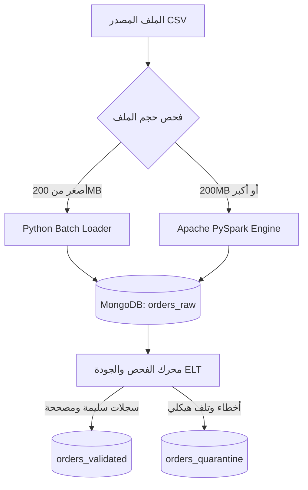

```markdown
<div align="center">

# ⚡ High-Throughput Hybrid ELT Big Data Pipeline
### معمارية هجينة لمعالجة البيانات الضخمة والتحقق الموزع ونمط الحجر الصحي

[](https://www.python.org/)
[](https://spark.apache.org/)
[](https://www.mongodb.com/)
[](https://en.wikipedia.org/wiki/Extract,_load,_transform)

<p align="center">
  <b>خط بيانات متكامل لمعالجة واستيعاب 30 مليون سجل بكفاءة عالية عبر PySpark و Python Streaming Batch و MongoDB.</b>
</p>

</div>

---

## 👩‍💻 إعداد وتطوير المشروع

<div align="center">

### **المهندسة: أبرار مروان الدبعي**
**مهندسة ذكاء اصطناعي وباحثة في هندسة البيانات الضخمة**

[](https://github.com/AbrarMarwan)

</div>

* **الجامعة:** جامعة الرازي — كلية الحاسوب وتكنولوجيا المعلومات.
* **التخصص:** بكالوريوس ذكاء اصطناعي (المستوى الرابع).
* **المقرر الأكاديمي:** البيانات الضخمة - العملي.
* **إشراف:** م. عمر أبوسند.

---

## 📌 1. نظرة عامة على المشروع (Overview)

يطبق المشروع خط بيانات هجين لمعالجة بيانات الطلبات الضخمة غير النظيفة وفق معمارية **ELT**:
* تطبيق مبدأ **عدم فقدان البيانات (Zero Data Loss)** بتحميل السجلات أولاً إلى طبقة `orders_raw` دون حذف مسبق.
* فرز وتصنيف السجلات آلياً إلى بيانات سليمة/مصححة في `orders_validated` أو معزولة في `orders_quarantine`.

---

## 🏗️ 2. مسار ومعمارية المعالجة (Pipeline Architecture)



---

## 💡 3. الركائز الهندسية الأساسية (Core Concepts)

* **التحميل الخام (Raw Layer):** حفظ كامل السجلات كما وردت مع ربطها بـ `run_id` والمصدر ورقم الصف.
* **أثر التصحيح (Audit Trail):** توثيق التعديلات في مصفوفة `corrections` مع تحديد `rule_code` والقيم السابقة والجديدة.
* **نمط الحجر الصحي (Quarantine Pattern):** عزل السجلات ذات الأخطاء الجوهرية (مثل فقدان `customer_id` أو تلف `items_json` أو أرقام هواتف غير يمنية) مع حفظ مصفوفة `error_codes` والنسخة الأصلية.
* **الاتساق وعدم التكرار (Idempotency & Upsert):** اعتماد `order_id` كمفتاح فريد يمنع التكرار عند إعادة التشغيل مع تحقق معادلة الاتساق الرياضي:

$$\text{Total Raw} (30,000,000) = \text{Valid} (23,765,736) + \text{Corrected} (4,011,232) + \text{Quarantined} (2,223,032)$$

---

## 📊 4. نتائج القياس والأداء الفعلي (Performance Benchmarks)

| المقياس | القيمة المسجلة الفعلية | الشرح الهندسي |
| --- | --- | --- |
| **إجمالي السجلات المعالجة** | **30,000,000** سجل | الحجم الكامل لبيانات الاختبار الفعلي (12.65GB). |
| **زمن استيعاب البيانات (PySpark)** | **2,763.81** ثانية | حوالي 46 دقيقة لتدفق وتخزين 30 مليون سجل بالكامل. |
| **معدل التدفق (Throughput)** | **10,854.6** سجل/ثانية | سرعة القراءة والكتابة الموزعة المتزامنة في MongoDB. |
| **السجلات المستوعبة في Raw** | **30,000,000** سجل | نجاح حفظ كافة البيانات بنسبة 100% دون فقدان. |
| **السجلات السليمة (Valid)** | **23,765,736** سجل | بيانات مطابقة للمواصفات دون الحاجة لأي تدخل. |
| **السجلات المصححة (Corrected)** | **4,011,232** سجل | بيانات تم إصلاحها وتوحيدها مع توثيق Audit Trail. |
| **سجلات العزل (Quarantine)** | **2,223,032** سجل | بيانات تالفة هيكلياً تم عزلها بنسبة واقعية (~7.4%). |
| **فحص الاتساق الرياضي** | **PASSED (OK)** | تطابق المعادلة: $23,765,736 + 4,011,232 + 2,223,032 = 30,000,000$. |
| **مقاييس الـ Upsert والتحديث** | Inserted: 27,489,117<br>

<br>Updated: 197,711<br>

<br>Unchanged: 90,140 | إثبات الـ Idempotency ومعالجة التكرارات عبر الفهرس الفريد. |

---

## 🛠️ 5. قواعد فحص وتصحيح البيانات (Data Quality Rules)

* **`DATE_STANDARDIZED`:** توحيد صيغ التواريخ المختلفة إلى صيغة `YYYY-MM-DD` مع الحفاظ على صيغة ISO القياسية كسجلات سليمة.
* **`CURRENCY_STANDARDIZED`:** توحيد المرادفات المحلية ("ريال", "سعودي", "دولار") إلى الرموز المصرفية المعتمدة (`YER`, `SAR`, `USD`).
* **`NUMBER_NORMALIZED`:** تحويل الأرقام المشرقية (٠-٩) إلى أرقام لاتينية، إزالة فواصل الآلاف، ومعالجة الأسعار المكتوبة بالكلمات ("ألفين").
* **`PHONE_NORMALIZED` / `INVALID_YEMENI_PHONE`:** فحص أرقام الهواتف المكونة من 9 أرقام والمطابقة لشبكات الاتصالات اليمنية (`77`, `78`, `73`, `71`, `70`) وعزل الأرقام الوهمية أو غير المتطابقة.
* **`EMAIL_REPEATED_SYMBOLS`:** معالجة تكرار علامات `@` أو النقاط الناتجة عن أخطاء الإدخال.
* **`JSON_SYNTAX_REPAIRED`:** معالجة علامات الاقتباس المزدوجة وإصلاح الأقواس المبتورة لعناصر الـ JSON.
* **`FATAL_CORRUPTION_ISOLATION`:** عزل الحالات الحرجة كغياب المعرفات الأساسية (`MISSING_ORDER_ID`, `MISSING_CUSTOMER_ID`) أو القيم المالية السالبة (`AMBIGUOUS_NEGATIVE_VALUE`).

---

## 📸 6. أدلة التشغيل والتنفيذ (Screenshots)

### 1. إثبات سرعة ومعدل تدفق PySpark وفحص الاتساق الرياضي (30 مليون سجل)

### 2. استعراض مجموعات MongoDB Compass وقواعد البيانات

### 3. عينة سجل معتمد ومطابق (Valid Record Sample)

### 4. عينة سجل معزول في الحجر الصحي مع أكواد الخطأ (Quarantine Record Sample)

---

## 💻 7. دليل التشغيل (How to Run)

```bash
# 1. تثبيت الحزم والمكتبات المطلوبة
pip install -r requirements.txt

# 2. تشغيل العينة الصغيرة (Python Batch Engine)
python src/main.py --file data/sample_orders.csv

# 3. تشغيل ملف البيانات الضخم (Apache PySpark Engine)
python src/main.py --file data/orders_huge_mixed_quality.csv

# 4. التحقق البرمجي من مجموعات وفهارس MongoDB
python -c "from pymongo import MongoClient; client=MongoClient('mongodb://localhost:27017'); print(client['midterm_bigdata_db'].list_collection_names())"

```

```

```
