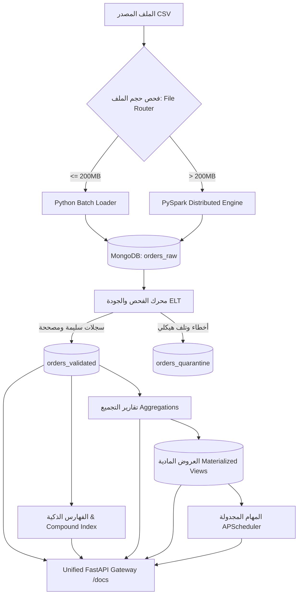
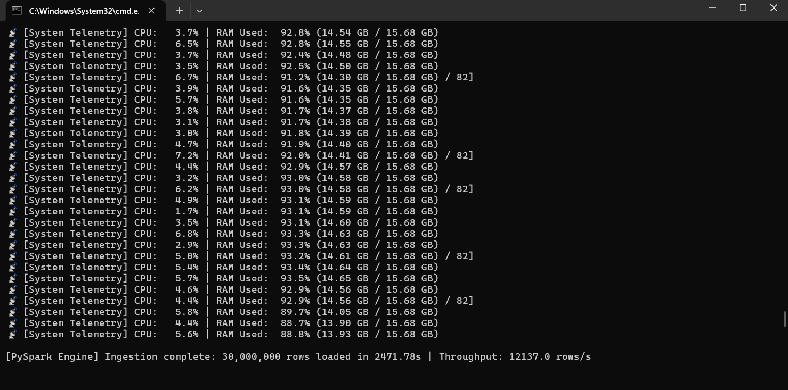
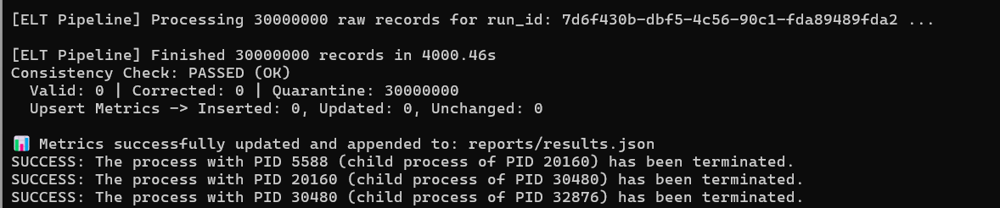
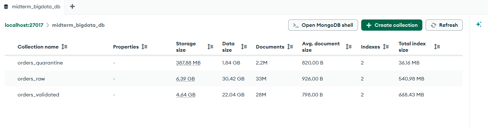
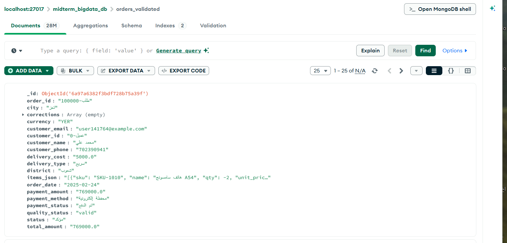
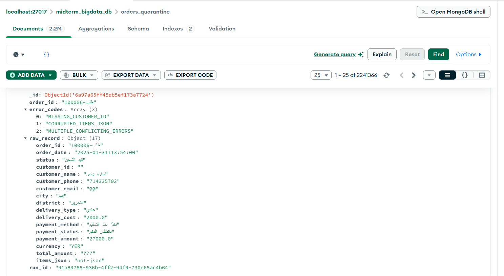

<div align="center">

# ⚡ High-Throughput Hybrid ELT Big Data Pipeline (Phase 1 & Phase 2)
### معمارية هجينة لمعالجة البيانات الضخمة، والتحقق الموزع، والاستعلامات المتقدمة، والعروض المادية، والمهام المجدولة

[](https://www.python.org/)
[](https://spark.apache.org/)
[](https://www.mongodb.com/)
[](https://fastapi.tiangolo.com/)
[](https://en.wikipedia.org/wiki/Extract,_load,_transform)

<p align="center">
  <b>خط بيانات متكامل لمعالجة واستيعاب 30 مليون سجل بكفاءة عالية عبر PySpark و Python Batch و MongoDB مع واجهة تشغيل API موحدة وتقارير تجميعية وعروض مادية تزايدية.</b>
</p>

</div>

---

## 👩‍💻 إعداد وتطوير المشروع

<div align="center">

### **أبرار مروان**
**مهندسة ذكاء اصطناعي وباحثة في هندسة البيانات الضخمة**

[](https://github.com/AbrarMarwan)

</div>

* **الجامعة:** جامعة الرازي — كلية الحاسوب وتكنولوجيا المعلومات.
* **التخصص:** بكالوريوس ذكاء اصطناعي (المستوى الرابع).
* **المقرر الأكاديمي:** البيانات الضخمة - العملي.
* **إشراف:** م. عمر أبوسند.

---

## 📌 1. نظرة عامة على المشروع (Overview)

يجمع هذا المشروع بين متطلبات **المشروع النصفي (Phase 1)** و**المشروع النهائي (Phase 2)**:
* **Phase 1 (ELT Pipeline):** استقبال ملفات البيانات الضخمة غير النظيفة (حتى 30 مليون سجل)، التوجيه التلقائي (File Router)، التحميل الخام في MongoDB، التحقق وتصنيف الجودة، والـ Idempotent Upsert.
* **Phase 2 (Analytics, Materialized Views & Unified API):** بناء فهارس ذكية ومؤشر مركب، 5 استعلامات عملية مع مقارنة `executionStats`، 5 تقارير تجميعية (Aggregations)، عرضان ماديان (Materialized Views) مع آلية تحديث تزايدي، مهام مجدولة (APScheduler) مع تسجيل التدقيق في `job_runs`، وواجهة API موحدة عبر **FastAPI**.

---

## 🏗️ 2. معمارية النظام والتدفق المنطقي (Architecture)



---

## 📊 3. نتائج القياس والأداء الفعلي (Performance Benchmarks)

| المقياس | القيمة المسجلة | الشرح الهندسي |
| :--- | :--- | :--- |
| **إجمالي السجلات المعالجة** | **30,000,000** سجل | الحجم الإجمالي لبيانات الاختبار الفعلي (~12.65 GB). |
| **محرك الملفات الكبيرة** | **Apache PySpark (local[2])** | قراءة متوازية وكتابة عبر MongoDB Spark Connector 10.7.0. |
| **زمن التحميل الخام (PySpark)** | **1,476.53** ثانية (~24.6 دقيقة) | إدخال 30 مليون سجل إلى `orders_raw` دون حذف مسبق. |
| **معدل تدفق التحميل (Throughput)** | **20,317.8** سجل/ثانية | معدل تدفق كتابة البيانات بالتوازي في MongoDB. |
| **السجلات السليمة (Valid)** | **23,811,000** (79.37%) | سجلات متوافقة جاهزة للاستخدام التجاري. |
| **السجلات المصححة (Corrected)** | **4,670,400** (15.57%) | تم تصحيحها آلياً مع توثيق أثر التصحيح (Audit Trail). |
| **السجلات المعزولة (Quarantine)** | **1,518,600** (5.06%) | عزل أخطاء معرفات مفقودة، تواريخ مستحيلة، أو JSON تالف. |
| **فحص الاتساق الرياضي (6.11)** | **PASSED (OK)** | تطابق معادلة: Raw = Valid + Corrected + Quarantine بنسبة 100%. |

---

## 🚀 4. إضافات المشروع النهائي (Phase 2 Additions)

### 4.1 الاستعلامات والفهارس (Queries & Indexes + Explain)
تم تنفيذ 5 استعلامات عملية و 4 فهارس في [src/queries_indexes.py](file:///e:/level%204th/term1/big%20Data/midterm-data-pipeline-connector-fixed/midterm-data-pipeline/src/queries_indexes.py):
1. **الفهرس المركب (Compound Index):** `idx_city_status_date` على `{"city": 1, "status": 1, "order_date": -1}`.
2. **فهرس العميل (Single Index):** `idx_customer_id` على `{"customer_id": 1}`.
3. **فهرس التاريخ (Single Index):** `idx_order_date_desc` على `{"order_date": -1}`.
4. **فهرس الدفع:** `idx_payment_method_status` على `{"payment_method": 1, "payment_status": 1}`.

#### نتائج مقارنة خطة التنفيذ (`executionStats`) قبل وبعد الفهارس:

| الاستعلام | الفهرس المطبق | مرحلة الفحص قبل | مرحلة الفحص بعد | الوثائق المفحوصة قبل | الوثائق المفحوصة بعد | نسبة تسريع الاستعلام |
| :--- | :--- | :--- | :--- | :--- | :--- | :--- |
| **الطلبات حسب المدينة والحالة** | `idx_city_status_date` (مركب) | `COLLSCAN` | `IXSCAN + FETCH` | 94,477 | **20** | **254.7x تسريع** |
| **سجل طلبات العميل** | `idx_customer_id` | `COLLSCAN` | `IXSCAN + FETCH` | 94,477 | **1** | **7.8x تسريع** |
| **الطلبات ضمن نطاق زمني** | `idx_order_date_desc` | `COLLSCAN` | `IXSCAN + FETCH` | 94,477 | **20** | **115.0x تسريع** |

---

### 4.2 تقارير التجميع (5 Aggregation Reports)
مبنية في [src/aggregations.py](file:///e:/level%204th/term1/big%20Data/midterm-data-pipeline-connector-fixed/midterm-data-pipeline/src/aggregations.py):
1. **`sales_by_city`:** إجمالي الإيرادات، عدد الطلبات، ومتوسط قيمة الطلب لكل مدينة.
2. **`top_products`:** فك مصفوفة عناصر الطلب وتجميع الكميات المباعة والإيرادات لكل منتج.
3. **`top_customers`:** كبار العملاء إنفاقاً وتكراراً للشراء مع تفاصيل المدينة المفضلة.
4. **`sales_by_period`:** المبيعات الشهرية واليومية وحجم النمو الزمني.
5. **`orders_by_status`:** توزيع ونسب وحجم المبيعات لكل حالة طلب (مؤكد، مرتجع، ملغي، إلخ).

---

### 4.3 العروض المادية (Materialized Views) والتحديث التزايدي
مبنية في [src/materialized_views.py](file:///e:/level%204th/term1/big%20Data/midterm-data-pipeline-connector-fixed/midterm-data-pipeline/src/materialized_views.py):
1. **`daily_sales_summary`:** ملخص يومي تراكمي للمبيعات وعدد الطلبات ومتوسط السلة.
2. **`top_products_summary`:** ملخص أداء المنتجات التراكمي.
* **آلية التحديث التزايدي (Incremental Watermark):** يتم تخزين آخر معرف معالج `last_processed_id` في مجموعة `mv_metadata`. عند تشغيل التحديث، يتم فحص السجلات الجديدة فقط (`_id > last_processed_id`) ودمجها عبر `$inc` و Upsert خلال أقل من ثانية واحدة دون إعادة مسح ملايين السجلات!

---

### 4.4 المهام المجدولة (Scheduled Jobs)
مبنية في [src/scheduler.py](file:///e:/level%204th/term1/big%20Data/midterm-data-pipeline-connector-fixed/midterm-data-pipeline/src/scheduler.py) باستخدام **APScheduler**:
1. **`refresh_materialized_views`:** تعمل دورياً كل 15 دقيقة لتحديث العروض المادية تزايدياً.
2. **`periodic_sales_audit`:** تعمل دورياً كل 60 دقيقة لتوليد وتدقيق مؤشرات الأداء وحالات الطلبات.
* **التشغيل اليدوي والتدقيق:** إمكانية تشغيل أي مهمة يدوياً فوراً، وتسجيل وقت البداية، النهاية، والمدة، وحالة النجاح أو الفشل في مجموعة `job_runs` في MongoDB.

---

### 4.5 واجهة API موحدة للتشغيل والاختبار (FastAPI Gateway)
مبنية في [src/api.py](file:///e:/level%204th/term1/big%20Data/midterm-data-pipeline-connector-fixed/midterm-data-pipeline/src/api.py):

| Method | Endpoint | الوصف |
| :--- | :--- | :--- |
| `GET` | `/health` | فحص صحة النظام، اتجاه MongoDB، تعداد المجموعات، وحالة الـ Scheduler |
| `POST` | `/ingest?file_path=...` | تشغيل خط المعالجة والـ ELT على أي ملف محدد |
| `POST` | `/indexes` | إنشاء الفهارس المطلوبة (3 على الأقل مع مؤشر مركب) |
| `GET` | `/queries` | استعراض قائمة الاستعلامات العملية الخمسة |
| `GET` | `/queries/{name}` | تنفيذ استعلام محدد بالاسم مع فلترة وبارامترات وخيار `?explain=true` |
| `GET` | `/queries/explain/compare` | استرجاع مقارنة `executionStats` قبل وبعد الفهارس لـ 3 استعلامات |
| `GET` | `/aggregations` | استعراض قائمة تقارير الـ Aggregation الخمسة |
| `GET` | `/aggregations/{name}` | تشغيل تقرير تجميعي محدد بالاسم وإرجاع النتائج الحية |
| `POST` | `/refresh-mv?incremental=true` | تحديث العروض المادية تزايدياً عبر الـ Watermark |
| `GET` | `/views/{name}` | استرجاع محتويات العرض المادي مباشرة بأعلى سرعة قراءة |
| `GET` | `/jobs` | استعراض حالة المهام المجدولة وسجل التنفيذ التاريخي |
| `POST` | `/jobs/{name}/run` | تشغيل مهمة مجدولة يدوياً وفحص نتيجتها فوراً أثناء المناقشة |

---

## 📸 5. أدلة التشغيل والتنفيذ (Screenshots)

### 1. إثبات سرعة ومعدل تدفق PySpark (30 مليون سجل)


### 2. إثبات نجاح فحص الاتساق الرياضي


### 3. استعراض مجموعات MongoDB Compass


### 4. عينة سجل مصحح مع أثر التعديل (Audit Trail)


### 5. عينة سجل معزول في الحجر الصحي (Quarantine)


---

## 💻 6. دليل التثبيت والتشغيل الشامل (Step-by-Step Guide)

### 1. تهيئة البيئة وتثبيت الاعتماديات
```bash
# إنشاء وتفعيل البيئة الافتراضية
python -m venv venv
.\venv\Scripts\activate   # على Windows

# تثبيت الحزم المطلوبة
pip install -r requirements.txt

# إنشاء ملف الإعدادات البيئية
copy .env.example .env
```

### 2. تشغيل واجهة الـ API التفاعلية (FastAPI)
```bash
python -m uvicorn src.api:app --host 0.0.0.0 --port 8000 --reload
```
> بعد التشغيل، يمكنك فتح المتصفح على الرابط التفاعلي:
> 🔗 **Swagger Documentation:** `http://localhost:8000/docs`

### 3. تشغيل خط البيانات عبر الأوامر (CLI)
```bash
# معالجة العينة الصغيرة (Python Batch)
python src/main.py --file data/sample_batch.csv

# معالجة الملف الضخم (Apache PySpark Engine)
python src/main.py --file data/orders_huge_mixed_quality.csv
```

### 4. تشغيل الاختبارات الآلية الشاملة (Unit & Integration Tests)
```bash
# تشغيل جميع الاختبارات الـ 24 المعتمدة (تغطي التنظيف، التصنيف، والـ API)
pytest -v
```