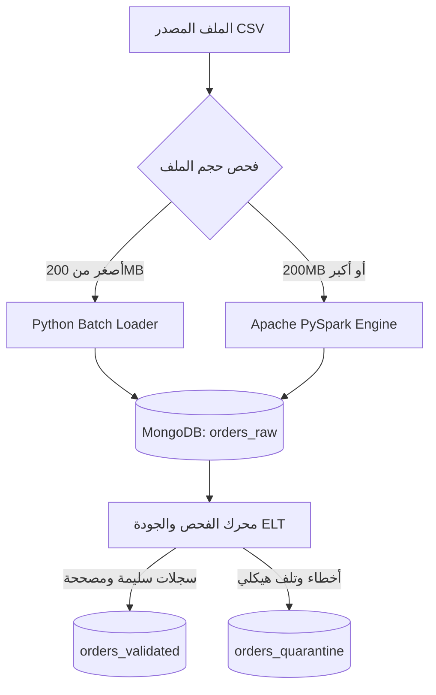

 
<div align="center">

# ⚡ High-Throughput Hybrid ELT Big Data Pipeline
### معمارية هجينة لمعالجة البيانات الضخمة والتحقق الموزع ونمط الحجر الصحي

[](https://www.python.org/)
[](https://spark.apache.org/)
[](https://www.mongodb.com/)
[](https://en.wikipedia.org/wiki/Extract,_load,_transform)

<p align="center">
  <b>خط بيانات متكامل لمعالجة واستيعاب 30 مليون سجل بكفاءة عالية عبر PySpark و Python Batch و MongoDB[cite: 1].</b>
</p>

</div>

---

## 👩‍💻 إعداد وتطوير المشروع

<div align="center">

### **أبرار مروان**
**مهندسة ذكاء اصطناعي وباحثة في هندسة البيانات الضخمة**

[](https://github.com/AbrarMarwan)

</div>

* **الجامعة:** جامعة الرازي — كلية الحاسوب وتكنولوجيا المعلومات[cite: 1].
* **التخصص:** بكالوريوس ذكاء اصطناعي (المستوى الرابع)[cite: 1].
* **المقرر الأكاديمي:** البيانات الضخمة - العملي[cite: 1].
* **إشراف:** م. عمر أبوسند[cite: 1].

---

## 📌 1. نظرة عامة على المشروع (Overview)

يطبق المشروع خط بيانات هجين لمعالجة بيانات الطلبات الضخمة غير النظيفة وفق معمارية **ELT**[cite: 1]:
* تطبيق مبدأ **عدم فقدان البيانات (Zero Data Loss)** بتحميل السجلات أولاً إلى طبقة `orders_raw` دون حذف مسبق[cite: 1].
* فرز وتصنيف السجلات آلياً إلى بيانات سليمة/مصححة في `orders_validated` أو معزولة في `orders_quarantine`[cite: 1].

---

## 🏗️ 2. مسار ومعمارية المعالجة (Pipeline Architecture)



---

## 💡 3. الركائز الهندسية الأساسية (Core Concepts)

* **التحميل الخام (Raw Layer):** حفظ كامل السجلات كما وردت مع ربطها بـ `run_id` والمصدر ورقم الصف.


* **أثر التصحيح (Audit Trail):** توثيق التعديلات الشكلية (مثل توحيد التواريخ) في مصفوفة `corrections` مع تحديد `rule_code`.


* **نمط الحجر الصحي (Quarantine Pattern):** عزل السجلات ذات الأخطاء الجوهرية (مثل فقدان `customer_id` أو تلف `items_json`) مع حفظ مصفوفة `error_codes` والنسخة الأصلية.


* **الاتساق وعدم التكرار (Idempotency & Upsert):** اعتماد `order_id` كمفتاح فريد يمنع التكرار عند إعادة التشغيل مع تحقق معادلة الاتساق:


$$\text{Total Raw} = \text{Validated} + \text{Quarantined}$$


---

## 📊 4. نتائج القياس والأداء الفعلي (Performance Benchmarks)

| المقياس | القيمة المسجلة | الشرح الهندسي |
| --- | --- | --- |
| **إجمالي السجلات المعالجة** | **30,000,000** سجل

 | الحجم الإجمالي لبيانات الاختبار الفعلي.

 |
| **زمن التحميل عبر PySpark** | **2,471.78** ثانية | حوالي 41 دقيقة لإدخال 12.65GB. |
| **معدل التدفق (Throughput)** | **12,137.0** سجل/ثانية | معدل تدفق كتابة البيانات بالتوازي.

 |
| **السجلات المستوعبة في Raw** | **30,000,000** سجل

 | نجاح حفظ كافة البيانات بنسبة 100%.

 |
| **فحص الاتساق الرياضي** | **PASSED (OK)**<br> | تطابق السجلات بالكامل دون فقدان.

 |

---

## 🛠️ 5. قواعد فحص وتصحيح البيانات (Data Quality Rules)

* **`DATE_STANDARDIZED`:** توحيد صيغ التواريخ المختلفة إلى `YYYY-MM-DD`.


* **`CURRENCY_NORMALIZED`:** تنظيف النصوص وتوحيد العملة إلى `YER`.


* **`ARABIC_DIGIT_CONVERSION`:** تحويل الأرقام المشرقية (٠-٩) إلى أرقام لاتينية.


* **`PRICE_PARSER`:** إزالة فواصل الآلاف ومعالجة الأسعار النصية.


* **`PHONE_SANITIZATION`:** توحيد المفاتيح وصيغ أرقام الهواتف.


* **`EMAIL_SYNTAX_REPAIR`:** إصلاح الرموز المكررة في البريد الإلكتروني.


* **`FATAL_CORRUPTION_ISOLATION`:** عزل السجلات التالفة (`CORRUPTED_ITEMS_JSON` و `MISSING_CUSTOMER_ID`).


---

## 📸 6. أدلة التشغيل والتنفيذ (Screenshots)

### 1. إثبات سرعة ومعدل تدفق PySpark (30 مليون سجل)

### 2. إثبات نجاح فحص الاتساق الرياضي

### 3. استعراض مجموعات MongoDB Compass

### 4. عينة سجل مصحح مع أثر التعديل (Audit Trail)

### 5. عينة سجل معزول في الحجر الصحي (Quarantine)

---

## 💻 7. دليل التشغيل (How to Run)

```bash
# 1. تثبيت الحزم
pip install -r requirements.txt

# 2. تشغيل العينة الصغيرة (Python Batch)
python src/main.py --file data/sample_batch.csv

# 3. تشغيل الملف الضخم (PySpark Engine)
python src/main.py --file data/orders_huge_mixed_quality.csv

# 4. فحص المجموعات والفهارس
python check_mongo.py

# 5. تشغيل اختبارات الوحدة
python tests/test_cleaning_rules.py

```

---

---
 
```